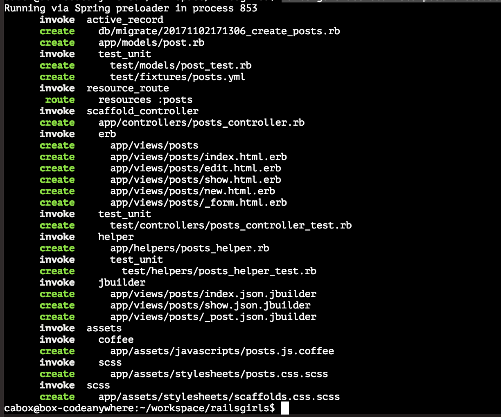

# Vamos começar a criar nosso blog?

No terminal, escreva o comando abaixo:

```sh
rails generate scaffold Post title:string text:text author:string created_date:datetime published_date:datetime
```
Esse comando vai criar uma série de arquivos que já vão possibilitar a criação, atualização e exclusão de posts.

No terminal você verá algo como a imagem abaixo, estes são todos os arquivos que ele cria. Neles estão incluídos os arquivos com código ruby, que faŕa tudo funcionar, e também com HTML, que é o que veremos no navegador.



### Verificando se tudo está funcionando

Vamos ver o que temos aparece no navegador agora, no terminal digite:

```sh
rails server
```

E acesse o endereço que acessamos antes para ver o site, deve ser algo parecido com isso:

```
https://railsgirls-carolinemoers694501.codeanyapp.com/
```


Ooops, algo estranho aconteceu. Esse é o nosso primeiro erro, sempre que algo não estiver correto, o Rails irá avisar a gente com uma tela parecida com a da imagem, informando o erro que está acontecendo.

Como o idioma do Rails é inglês, essas mensagens serão em inglês, mas você sempre pode usar o Google Tradutor, se precisar.

### Ok, mas como resolver?

O que o Rails está nos dizendo é que nós criamos o Post, mas não dissemos como e onde vamos salvá-lo. A mensagem do início `Migration are pending`, significa que criamos um arquivo, dizendo o que criar no banco de dados, mas não executamos ele. Vamos fazer isso então, no terminal digite:

```sh
rake db:migrate
```

Esse comando, diz para o Rails executar todas as migrações que criamos, esse arquivos foi criado ao executarmos o comando `scaffold`, que criou aquele monte de arquivos pra gente, lembra?

Deve aparecer algo parecido no terminal:
```
$ rake db:migrate
== 20171102171306 CreatePosts: migrating ======================================
-- create_table(:posts)
   -> 0.0019s
== 20171102171306 CreatePosts: migrated (0.0020s) =============================
```

### Vamos ver o que aparece no navegador agora?

```sh
rails server
```

E vamos visualizar no navegador:


Lindo!! Apareceu a tela de que indica que tudo está funcionando de novo! :D

Ok, mas onde estão os nossos posts?
